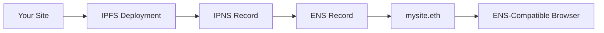

# ENS (Ethereum Name Service)

Connect your Alternate Futures sites to Ethereum Name Service (ENS) domains for decentralized, human-readable URLs.

## What is ENS?

ENS (Ethereum Name Service) is a distributed, open naming system based on the Ethereum blockchain. It allows you to:

- Map human-readable names (like `mysite.eth`) to content hashes
- Point ENS domains to your IPFS/IPNS content
- Create truly decentralized websites accessible via ENS-compatible browsers

## Prerequisites

- An ENS domain you own (e.g., purchased from [app.ens.domains](https://app.ens.domains))
- A deployed site with an IPNS record
- Access to manage your ENS domain's content hash

## Creating an ENS Record

::: code-group

```bash [CLI]
# Create an ENS record for your site
af ens create

# You'll be prompted for:
# - ENS name (e.g., mysite.eth)
# - Site to link
# - IPNS record to use
```

```typescript [SDK]
import { AlternateFuturesSdk } from '@alternatefutures/sdk/node';

const af = new AlternateFuturesSdk({
  personalAccessToken: process.env.AF_TOKEN
});

// Create an ENS record
const ensRecord = await af.ens().create({
  name: 'mysite.eth',
  siteId: 'site-id',
  ipnsRecordId: 'ipns-record-id'
});

console.log('ENS Record created:', ensRecord.name);
console.log('Content hash:', ensRecord.ipnsRecord.hash);
```

:::

## Listing ENS Records

::: code-group

```bash [CLI]
# List all ENS records
af ens list
```

```typescript [SDK]
// List all ENS records
const records = await af.ens().list();

records.forEach(record => {
  console.log(`${record.name} -> ${record.ipnsRecord.name}`);
  console.log(`Status: ${record.status}`);
});
```

:::

## Viewing ENS Record Details

::: code-group

```bash [CLI]
# Get details for a specific ENS record
af ens detail

# You'll be prompted to select the ENS record
```

```typescript [SDK]
// Get ENS record by name
const record = await af.ens().getByName({ name: 'mysite.eth' });

console.log('ENS Name:', record.name);
console.log('IPNS Name:', record.ipnsRecord.name);
console.log('Content Hash:', record.ipnsRecord.hash);
console.log('Status:', record.status);
```

:::

## Verifying ENS Setup

After creating an ENS record, you need to manually update your ENS domain's content hash:

::: code-group

```bash [CLI]
# Verify your ENS setup
af ens verify

# This checks if your ENS domain's content hash
# matches the IPNS record from Alternate Futures
```

```typescript [SDK]
// Get the content hash you need to set
const record = await af.ens().getByName({ name: 'mysite.eth' });
console.log('Set your ENS content hash to:', record.ipnsRecord.hash);

// The SDK doesn't automatically update ENS
// You must do this manually via ENS interface
```

:::

## Setting Up ENS Content Hash

1. **Get your IPNS hash** from Alternate Futures:
   ```bash
   af ens detail
   # Note the IPNS hash (starts with /ipns/...)
   ```

2. **Go to ENS Manager** at [app.ens.domains](https://app.ens.domains)

3. **Find your domain** and click "Set Content Hash"

4. **Paste the IPNS hash** from step 1

5. **Confirm the transaction** on Ethereum

6. **Verify** the setup:
   ```bash
   af ens verify
   ```

## Deleting an ENS Record

::: code-group

```bash [CLI]
# Delete an ENS record
af ens delete

# You'll be prompted to select which ENS record to delete
```

```typescript [SDK]
// Delete an ENS record
await af.ens().delete({ id: 'ens-record-id' });
```

:::

## How ENS Integration Works



1. Your site is deployed to IPFS
2. An IPNS record points to your latest deployment
3. Alternate Futures creates an ENS record linking to the IPNS
4. You update your ENS domain's content hash
5. Users can access your site at `mysite.eth`

## Accessing ENS Sites

Users can access your ENS site through:

### ENS-Compatible Browsers
- [Brave Browser](https://brave.com) - Built-in ENS support
- [Opera](https://www.opera.com) - Native ENS resolution
- [MetaMask](https://metamask.io) - Browser extension with ENS

### ENS Gateways
- `https://mysite.eth.link` - Public gateway
- `https://mysite.eth.limo` - Alternative gateway

### IPFS Gateways
Users can also access via IPNS:
```
https://ipfs.io/ipns/your-ipns-name
https://gateway.ipfs.io/ipns/your-ipns-name
```

## Automatic Updates

When you deploy new versions of your site:

1. IPFS deployment creates new CID
2. IPNS record automatically updates to point to new CID
3. ENS content hash continues to point to IPNS name
4. Users automatically see latest version at `mysite.eth`

No manual ENS updates needed after initial setup!

## Best Practices

::: tip Best Practices
- Use IPNS records for dynamic content (regularly updated sites)
- Set up ENS during initial site launch for consistent branding
- Test access through multiple ENS gateways
- Keep your ENS domain registration current
- Document your ENS setup for team members
:::

## Troubleshooting

### ENS Verification Fails

**Problem:** `af ens verify` shows mismatch

**Solutions:**
- Wait 5-10 minutes for Ethereum blockchain confirmation
- Check you pasted the correct IPNS hash
- Verify transaction was confirmed on Etherscan
- Try clearing your browser cache

### Site Not Loading on ENS

**Problem:** `mysite.eth` doesn't load in browser

**Solutions:**
- Confirm browser has ENS support (try Brave)
- Use `.eth.link` gateway: `mysite.eth.link`
- Check IPNS record is published: `af ipns list`
- Verify content hash in ENS manager

### Content Not Updating

**Problem:** ENS shows old version of site

**Solutions:**
- Check IPNS record updated: `af ipns list`
- IPNS propagation can take 5-10 minutes
- Clear browser cache
- Try different ENS gateway

## Next Steps

- [IPNS Records](./ipns.md) - Manage IPNS records
- [Sites](./sites.md) - Deploy and manage sites
- [Custom Domains](./custom-domains.md) - Use traditional domains
