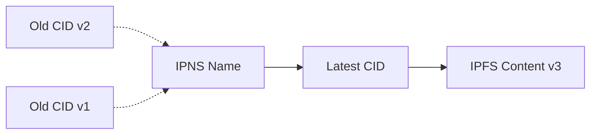

# IPNS (InterPlanetary Name System)

Use IPNS to create mutable pointers to your IPFS content, enabling dynamic updates without changing URLs.

## What is IPNS?

IPNS (InterPlanetary Name System) is a system for creating mutable pointers to IPFS content. While IPFS content is immutable (CID changes with each update), IPNS provides:

- **Stable URLs** - Same IPNS name for all versions of your content
- **Dynamic Updates** - Update content without changing the link
- **Human-Readable Names** - Can be linked with ENS domains
- **Decentralized** - No central authority required

## How IPNS Works



- IPNS name stays constant: `/ipns/k51qzi5uqu5di...`
- Points to current CID: `Qm...` or `bafy...`
- Update by publishing new CID to same IPNS name
- Old versions still accessible via their CIDs

## Creating an IPNS Record

::: code-group

```bash [CLI]
# Create IPNS record for a site
af ipns create --site-id <site-id>

# The IPNS record will automatically point to
# the site's latest deployment
```

```typescript [SDK]
import { AlternateFuturesSdk } from '@alternatefutures/sdk/node';

const af = new AlternateFuturesSdk({
  personalAccessToken: process.env.AF_TOKEN
});

// Create IPNS record for a site
const ipnsRecord = await af.ipns().createRecordForSite({
  siteId: 'site-id'
});

console.log('IPNS Name:', ipnsRecord.name);
console.log('Current Hash:', ipnsRecord.hash);
```

:::

## Listing IPNS Records

::: code-group

```bash [CLI]
# List all IPNS records
af ipns list
```

```typescript [SDK]
// List all IPNS records
const records = await af.ipns().listRecords();

records.forEach(record => {
  console.log(`Name: ${record.name}`);
  console.log(`Hash: ${record.hash}`);
  console.log(`ID: ${record.id}`);
});
```

:::

## Publishing Updates

When you deploy a new version of your site, the IPNS record automatically updates to point to the new content.

You can also manually publish a new hash:

::: code-group

```bash [CLI]
# Publish new content to IPNS record
af ipns publish \
  --ipns-id <ipns-id> \
  --hash <new-ipfs-cid>
```

```typescript [SDK]
// Publish new content to IPNS
await af.ipns().publishRecord({
  id: 'ipns-record-id',
  hash: 'QmNewContentHash...'
});
```

:::

## Resolving IPNS Names

Check what content an IPNS name currently points to:

::: code-group

```bash [CLI]
# Resolve IPNS name to current CID
af ipns resolve --name <ipns-name>
```

```typescript [SDK]
// Resolve IPNS name
const resolved = await af.ipns().resolveName({
  name: '/ipns/k51qzi5uqu5di...'
});

console.log('Current CID:', resolved);
```

:::

## Deleting an IPNS Record

::: code-group

```bash [CLI]
# Delete an IPNS record
af ipns delete --ipns-id <ipns-id>
```

```typescript [SDK]
// Delete IPNS record
await af.ipns().deleteRecord({
  id: 'ipns-record-id'
});
```

:::

## Accessing Content via IPNS

Access your content through IPNS:

### Public IPFS Gateways
```
https://ipfs.io/ipns/<ipns-name>
https://dweb.link/ipns/<ipns-name>
https://cloudflare-ipfs.com/ipns/<ipns-name>
```

### Alternate Futures Gateway
```
https://ipfs.alternatefutures.ai/ipns/<ipns-name>
```

### Private Gateway
If you have a private gateway:
```
https://your-gateway.com/ipns/<ipns-name>
```

### ENS Integration
Link your IPNS to ENS:
```
https://yoursite.eth
https://yoursite.eth.link
https://yoursite.eth.limo
```

## Automatic Updates

IPNS records automatically update when you deploy:

```bash
# Deploy new version of site
af sites deploy ./dist --site-id <site-id>

# IPNS record automatically updates to new CID
# Users accessing /ipns/<name> see new version
```

The flow:
1. Deploy creates new IPFS CID
2. Deployment completes successfully
3. Site's IPNS record updated to new CID
4. Propagation across IPFS network (1-2 minutes)
5. Users see updated content

## Use Cases

### Website Hosting

```
- Deploy: yoursite.com → IPNS → IPFS
- Update: New deployment updates IPNS automatically
- Benefit: Consistent URL, dynamic content
```

### NFT Metadata

```
- Mint NFT with IPNS URI
- Update metadata without changing token
- Benefit: Evolving NFTs, dynamic attributes
```

### Documentation

```
- Docs at /ipns/<name>
- Update docs frequently
- Benefit: Latest version always at same URL
```

### App Updates

```
- dApp hosted on IPNS
- Push updates by deploying new version
- Benefit: Users always get latest version
```

## IPNS vs Direct IPFS

| Feature | IPFS (CID) | IPNS (Name) |
|---------|-----------|-------------|
| **Mutability** | Immutable | Mutable pointer |
| **URL Changes** | Yes (new CID each update) | No (same name) |
| **Speed** | Instant | 1-2 min propagation |
| **Caching** | Aggressive | Limited |
| **Best For** | Archives, versioning | Dynamic content, sites |

## IPNS + ENS

Combine IPNS with ENS for best of both worlds:

```
yoursite.eth → IPNS Name → Latest IPFS CID
```

Benefits:
- Human-readable domain (yoursite.eth)
- Automatic updates (IPNS)
- Decentralized hosting (IPFS)
- One-time ENS setup

Setup:
1. Create IPNS record for site
2. Create ENS record pointing to IPNS
3. Set ENS content hash (one time)
4. All future updates via IPNS automatically

## Performance Considerations

### Propagation Time

IPNS updates take time to propagate:
- **Initial publish**: 1-2 minutes
- **Subsequent updates**: 30-60 seconds
- **Global propagation**: 2-5 minutes

### Caching

IPNS caching is limited compared to IPFS:
- IPFS CIDs: Cached indefinitely
- IPNS names: Short TTL (minutes)
- Impact: More network lookups for IPNS

### Optimization

Improve IPNS performance:
1. **Use private gateway** - Faster resolution
2. **Pre-warm caches** - Access content after publishing
3. **Monitor propagation** - Check resolution before announcing
4. **Combine with CDN** - Cache at application level

## Troubleshooting

### IPNS Resolution Fails

**Problem:** Cannot resolve IPNS name

**Solutions:**
- Wait 2-3 minutes for propagation
- Try different gateway
- Verify IPNS record exists: `af ipns list`
- Check network connectivity to IPFS

### Old Content Still Showing

**Problem:** IPNS shows old version

**Solutions:**
- Clear browser cache
- Wait for propagation (2-5 minutes)
- Verify publish succeeded: `af ipns resolve`
- Try different IPFS gateway

### Slow Resolution

**Problem:** IPNS resolution takes long

**Solutions:**
- Use private gateway instead of public
- Pre-fetch content after publishing
- Consider caching layer in application
- Check IPFS daemon health

## Advanced: Custom IPNS Keys

For advanced users who want to manage their own IPNS keys:

```bash
# Generate IPNS key locally
ipfs key gen my-site

# Publish with custom key
ipfs name publish --key=my-site <CID>

# Import key to Alternate Futures (contact support)
```

## Best Practices

::: tip Best Practices
- **Use IPNS for sites** - Dynamic content that updates regularly
- **Use direct CIDs for archives** - Immutable content that never changes
- **Combine with ENS** - Get human-readable domains
- **Monitor propagation** - Check updates went through
- **Cache at app level** - Don't rely solely on IPFS caching
- **Set up monitoring** - Track IPNS resolution times
:::

## IPNS Name Format

IPNS names are cryptographic hashes:

```
CIDv0 (older): QmYwAPJzv5CZsnA625s3Xf2nemtYgPpHdWEz79ojWnPbdG
CIDv1 (newer): k51qzi5uqu5dgy83yw82...
```

Names are derived from:
- Public key (for self-certifying names)
- Or from peer ID
- Verifiable cryptographically

## Comparison with Traditional DNS

| Feature | DNS | IPNS |
|---------|-----|------|
| **Control** | Centralized registrars | Decentralized, self-sovereign |
| **Censorship** | Possible | Resistant |
| **Cost** | Annual fees | Network costs only |
| **Speed** | Fast (<100ms) | Slower (seconds) |
| **Setup** | Domain purchase | Key generation |

## Next Steps

- [ENS Integration](./ens.md) - Link IPNS with ENS domains
- [Sites](./sites.md) - Deploy sites with IPNS
- [Private Gateways](./gateways.md) - Faster IPNS resolution
- [Storage](./storage.md) - Manage IPFS content
